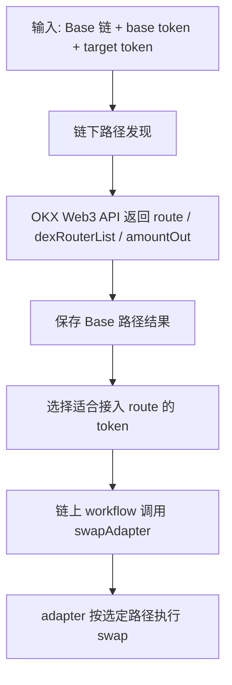

# Base 50 个 Token 路径总表

这份文档只回答一件事：

- 这 50 个 Base token 在 Base 链上，和 `USDC / USDT` 的兑换路径是什么

它 **不负责** 证明某个 Base token 在 Polygon 上的对应 OFT 是谁。

也就是说：
- 这份文档是 **Base 单链路径文档**
- 不是 **跨链映射文档**

跨链映射请看：
- `docs/Base到Polygon-OFT映射说明.md`

## 路径发现与执行关系图

## 说明

- `USDC_TO_TOKEN`: 用 1 USDC 买入目标 token 的路径。
- `TOKEN_TO_USDC`: 把上一步买到的 token 卖回 USDC 的路径。
- `USDT_TO_TOKEN`: 用 1 USDT 买入目标 token 的路径。
- `TOKEN_TO_USDT`: 把上一步买到的 token 卖回 USDT 的路径。
- `DEX`: 对应路径中涉及到的 DEX 组合。
- 这里的路径全部来自 OKX Web3 聚合器视角。
- 这些路径只能说明 Base 链上的可交易性，不能单独证明跨链对应关系。

## 全量结果
