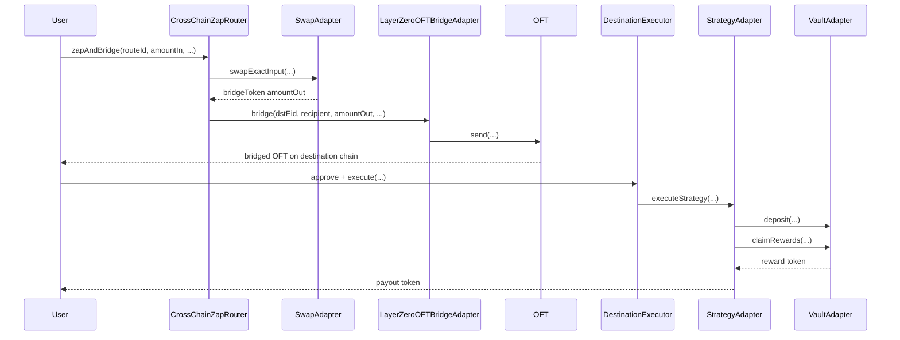

# Cross-Chain OFT Zap Architecture

This implementation splits the flow into three layers:

1. `CrossChainZapRouter`
   Source-chain entrypoint. Pulls user funds, performs the local swap, and sends the OFT token cross-chain.
2. `LayerZeroOFTBridgeAdapter`
   Standard OFT V2 wrapper. Encapsulates `quoteSend/send` so the main router is not coupled to one bridge API shape.
3. `DestinationExecutor`
   Destination-chain execution entrypoint. Pulls bridged OFT tokens from the user and hands them to a whitelisted strategy adapter.

Protocol differences are isolated behind two adapter surfaces:

- `ISwapAdapter`
  DEX-specific logic such as Uniswap V2, Pancake, or other router families.
- `IStrategyAdapter`
  Destination protocol logic such as vaults, staking systems, farms, or LP managers.

## Manual Execution Flow

The current design keeps the manual step: after bridging, an `EOA` or bot still submits the second transaction on the destination chain.

```mermaid
flowchart LR
    U[User / Bot] --> R[CrossChainZapRouter]
    R --> S[Swap Adapter]
    S --> B[LayerZero OFT Bridge Adapter]
    B --> O[OFT Token send]
    O --> LZ[LayerZero Message]
    LZ --> D[Destination Chain]
    D --> E[EOA receives bridged OFT]
    E --> X[Approve DestinationExecutor]
    X --> DE[DestinationExecutor]
    DE --> SA[Strategy Adapter]
    SA --> VA[Vault / Staking / Farm Adapter]
    VA --> RS[Reward Swap Adapter]
    RS --> P[Payout Token to User]
```

## Sequence View

## Contract Roles

- `src/CrossChainZapRouter.sol`
  Maintains `routeId -> RouteConfig`, so the same router supports multiple chains, OFTs, and input tokens.
- `src/adapters/LayerZeroOFTBridgeAdapter.sol`
  Wraps standard OFT send logic and adds owner-managed token allowlisting.
- `src/DestinationExecutor.sol`
  Maintains a strategy allowlist so destination execution stays governable and auditable.
- `src/strategies/VaultRewardSwapStrategy.sol`
  Example strategy that is not tied to one concrete protocol. Real protocol differences are injected through `IVaultAdapter` and encoded strategy data.

## How To Adapt To Another Chain Or OFT

Adding support usually means:

1. Deploy or reuse an `ISwapAdapter` on the source chain.
2. Allowlist the new OFT token in the bridge adapter.
3. Register a new `routeId` in `CrossChainZapRouter`.
4. Deploy a destination-side `IStrategyAdapter` or `IVaultAdapter`.
5. Allowlist that strategy in `DestinationExecutor`.

## Optional Future Upgrade

If you later want to remove the manual EOA step, there are two natural upgrade paths:

- Put strategy parameters into `composeMsg` and trigger destination execution automatically.
- Run an off-chain bot that listens to `ZapBridged` and submits `DestinationExecutor.execute` on the destination chain.

The first path is more automated. The second path is usually simpler to operate, easier to monitor, and easier to recover when execution fails.