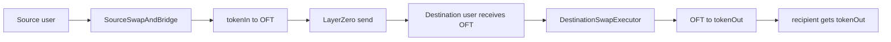

# Minimal Two-Step Contracts

These two contracts match the real flow shown by the Polygon and Base transactions:

1. Source chain:
   swap `tokenIn -> OFT`, then bridge the OFT through LayerZero.
2. Destination chain:
   user or bot submits a second transaction to swap `OFT -> tokenOut`.

## Contracts

- `src/examples/SourceSwapAndBridge.sol`
  Single-route source-chain contract for `swap + bridge`.
- `src/examples/DestinationSwapExecutor.sol`
  Single-token destination-chain contract for `receive OFT, then swap it`.

## Flow

## What To Keep From The Larger Architecture

- `ISwapAdapter`
- `IOFTBridgeAdapter`
- `UniswapV2SwapAdapter`
- `LayerZeroOFTBridgeAdapter`

## What To Ignore For The Simple Version

- vaults
- reward claims
- WBNB wrapping
- harvest logic
- strategy chaining beyond a plain destination swap

## What I Need If You Send More Hashes Later

Usually the hashes alone are enough for a fast first pass if:

1. You send the source-chain hash and destination-chain hash.
2. The tx pages are visible on OKLink.

Helpful extra info:

1. Which chain is source and which is destination.
2. Which token is the bridged OFT.
3. Whether the destination swap is manual or auto-triggered.
4. Whether you want a concrete single-route contract or a reusable framework.

If the contracts are verified on the explorer, I can usually infer the rest very quickly.