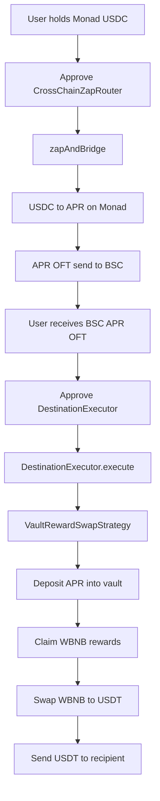

# Monad APR to BSC Yield Playbook

This playbook shows how the generic contracts map to the concrete APR flow you started from.

## Known Addresses

Source chain (Monad):
- USDC: `0x754704bc059f8c67012Fed69Bc8A327A5aAFB603`
- APR OFT: `0x0A332311633C0625f63cFc51EE33FC49826e0A3c`
- V2 router: `0x04dDF65a9E78A0f0E001807E5567996160767F33`

Destination chain (BSC):
- APR OFT: `0x299aD4299DA5B2b93FBa4c96967B040c7F611099`
- USDT: `0x55d398326f99059fF775485246999027B3197955`
- WBNB: `0xBb4CdB9CBd36B01bD1cBaEBF2De08d9173bc095c`
- Infinity vault: `0x238a358808379702088667322f80Ac48BaD5E6c4`
- Pancake-style router: `0xD9c500dFf816A1Da21A48A732D3498BF09dc9Aeb`
- BSC endpoint id: `30102`

Note: `0x55d398...` is BSC USDT, not BUSD.

## Concrete Flow



## Deployment Shape

You typically deploy these contracts:

1. On Monad
   - `UniswapV2SwapAdapter`
   - `LayerZeroOFTBridgeAdapter`
   - `CrossChainZapRouter`
2. On BSC
   - `UniswapV2SwapAdapter` for reward swaps
   - protocol-specific `IVaultAdapter`
   - `VaultRewardSwapStrategy`
   - `DestinationExecutor`

Then configure them:

1. Allowlist Monad APR OFT in `LayerZeroOFTBridgeAdapter`
2. Register the preset route in `CrossChainZapRouter`
3. Allowlist `VaultRewardSwapStrategy` in `DestinationExecutor`
4. Ensure the vault adapter knows how to talk to the target vault

## Source-Side Call

The preset helper in `src/presets/MonadAprBscPreset.sol` builds the source-chain request shape.

High-level call data:
- `routeId = keccak256("monad-usdc-to-bsc-apr-oft")`
- `tokenIn = Monad USDC`
- `bridgeToken = Monad APR OFT`
- `dstEid = 30102`
- `recipient = bytes32(uint256(uint160(userOrBotAddress)))`
- `swapData = abi.encode([Monad USDC, Monad APR OFT])`

Pseudo-flow:

```text
user approves USDC -> CrossChainZapRouter
user calls zapAndBridge{value: nativeFee}(...)
router pulls USDC
router swaps USDC -> APR
router forwards APR into OFT send
user receives APR OFT on BSC
```

## Destination-Side Call

A user or bot still sends the second transaction on BSC.

High-level call data:
- `inputToken = BSC APR OFT`
- `payoutToken = BSC USDT`
- `strategyAdapter = VaultRewardSwapStrategy`
- `strategyData.vaultAdapter = your BSC vault adapter`
- `strategyData.rewardSwapAdapter = your BSC reward swap adapter`
- `strategyData.rewardSwapData = abi.encode([WBNB, USDT])`

Pseudo-flow:

```text
user receives APR on BSC
user approves APR -> DestinationExecutor
user or bot calls execute(...)
executor pulls APR
strategy deposits APR into the vault
strategy claims WBNB rewards
strategy swaps WBNB -> USDT
strategy sends USDT to recipient
```

## Bot-Friendly Split

If you want a bot to handle the second step, the clean split is:

1. Bridge APR to the user's BSC EOA.
2. Bot watches for the bridge completion or token arrival.
3. Bot asks the user for approval once, or uses a dedicated recipient wallet.
4. Bot submits `DestinationExecutor.execute(...)` with current slippage bounds.

This is simpler to operate than LayerZero compose-based auto-execution because you can retry, pause, and update pricing logic off-chain.

## What Is Still Protocol-Specific

These parts are still adapter-specific and must be implemented per protocol:
- Vault deposit call shape
- Reward claim call shape
- Reward token assumptions
- Slippage protection for the reward swap
- Any async waiting between deposit and claim
## Encoding `SingleVaultAdapter`

`SingleVaultAdapter.deposit(...)` expects:
- `data = abi.encode(depositCallData, shareToken)`
- `depositCallData` is the raw calldata for the target vault deposit call
- `shareToken` is optional; use `address(0)` if the vault returns minted shares directly

`SingleVaultAdapter.claimRewards(...)` expects:
- `data = abi.encode(claimCallData)`
- `claimCallData` is the raw calldata for the target vault reward-claim call

Examples:

```text
depositData = abi.encode(
    abi.encodeWithSignature("deposit(uint256)", aprAmount),
    vaultShareToken
)

claimData = abi.encode(
    abi.encodeWithSignature("claimRewards()")
)
```

The adapter keeps the vault position inside itself, but forwards claimed rewards back to the strategy so the strategy can continue with the swap step.

## Caller Approval Wiring

After deployment, wire the trust boundaries explicitly:

1. In `DestinationExecutor`, allowlist the deployed `VaultRewardSwapStrategy`.
2. In `VaultRewardSwapStrategy`, allowlist the deployed `DestinationExecutor` as a caller.
3. In `SingleVaultAdapter`, allowlist the deployed `VaultRewardSwapStrategy` as a caller.

This prevents direct external calls from bypassing the executor and touching the shared vault position.

## Direct Swap Variant

If you do not want vault logic on the destination chain, use the simpler path:

- strategy: `DirectSwapStrategy`
- input token: destination OFT token
- payout token: target stablecoin or other tokenOut
- strategyData: `abi.encode(DirectSwapStrategy.DirectSwapData({ swapAdapter, swapData }))`

For the Monad APR to BSC example, the preset helper now exposes:
- `buildDirectSwapExecutionRequest(...)`

That produces the destination-side request for:
- `APR OFT -> USDT`

This is the version that matches the real-world two-step pattern more closely.
