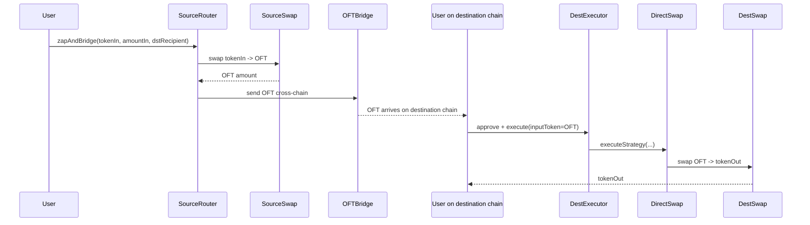

# Source Swap + Bridge, Destination Direct Swap

This is the simpler flow that matches the two real transactions you shared.

## Flow Diagram

```mermaid
flowchart LR
    A[User on source chain] --> B[Approve source router]
    B --> C[Source router swaps tokenIn to OFT]
    C --> D[Source router sends OFT through LayerZero]
    D --> E[User receives OFT on destination chain]
    E --> F[Approve destination executor]
    F --> G[Destination executor calls direct swap strategy]
    G --> H[Swap OFT to tokenOut on destination chain]
    H --> I[tokenOut sent to user]
```

## Sequence Diagram

## How The Existing Code Should Change

Keep:
- `CrossChainZapRouter`
- `LayerZeroOFTBridgeAdapter`
- `DestinationExecutor`
- `UniswapV2SwapAdapter`

Remove from the main happy path:
- vault deposit logic
- reward claim logic
- reward token assumptions
- async yield handling

Use this instead on the destination side:
- `DirectSwapStrategy`

## Mapping From Your Older Idea

Older destination idea:
- bridge OFT
- deposit into vault
- claim rewards
- swap rewards

What the real transactions do:
- bridge OFT
- direct swap OFT to tokenOut

So the destination chain becomes a plain swap executor, not a yield strategy manager.

## Contract Mapping

Source chain:
- `CrossChainZapRouter.zapAndBridge(...)`

Destination chain:
- `DestinationExecutor.execute(...)`
- `DirectSwapStrategy.executeStrategy(...)`

## Practical Example

If the source chain is Polygon and the destination chain is Base:
- source: `USDT -> USDC -> HANDL`, then bridge `HANDL`
- destination: `HANDL -> USDC`

That is exactly a two-transaction lifecycle:
1. source-chain swap + bridge
2. destination-chain manual swap