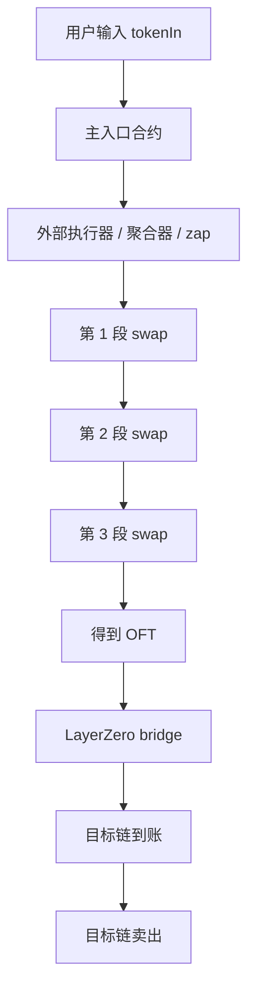
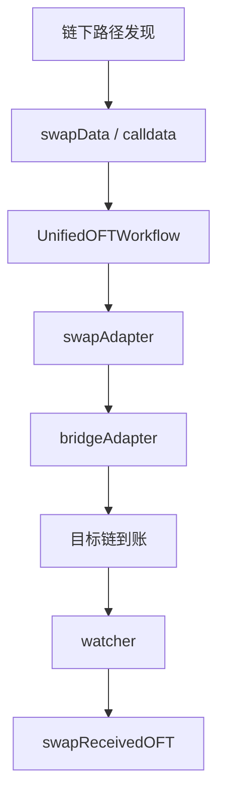
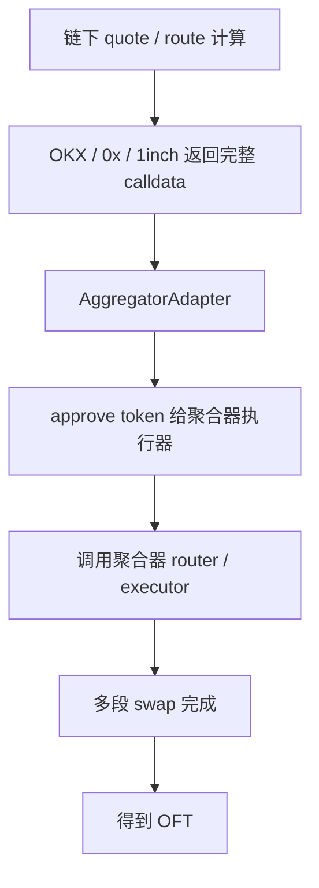
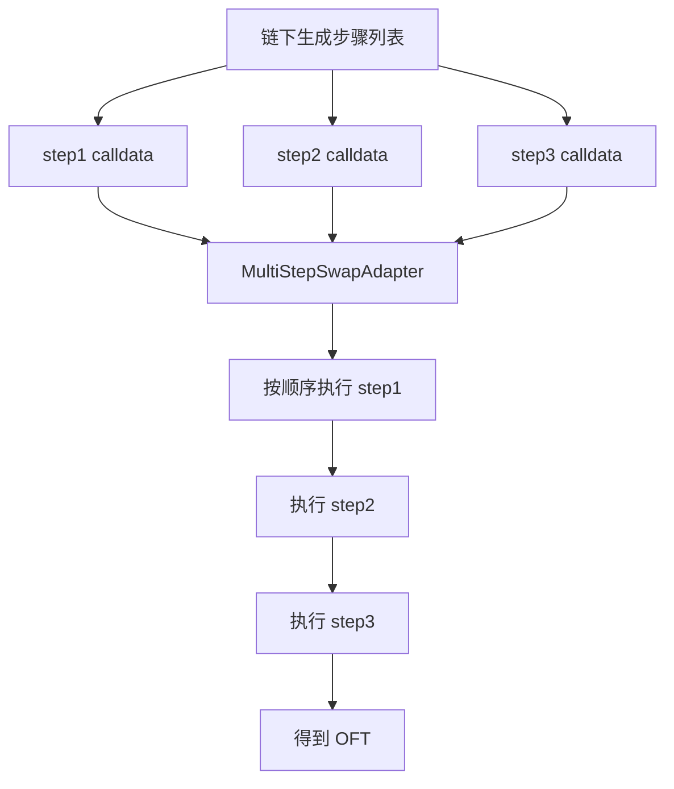

# 多段路径 Swap 可实现方案图

这份文档说明两件事：

1. 你给的主网样本交易，可能是如何做到“多段路径 swap”的
2. 我们自己的系统如果要支持这种能力，应该怎么接进去

## 一、样本主网交易可能的执行结构

这个结构的关键点：

- 主入口合约通常不是自己在链上算“最佳路径”
- 主入口合约更像是把资产交给一个会执行多段 swap 的执行器
- 多段 swap 可能发生在：
  - 聚合器 router
  - 项目自己的 zap / executor
  - 预定义的多步业务逻辑里

## 二、我们当前系统的位置

当前我们已经有：

当前已经支持的 swapAdapter 偏向：
- 单 router
- 单 pair
- 有限多 hop

不适合直接承接：
- 多协议混合路径
- 聚合器一次返回的复杂 calldata

## 三、方案 A：AggregatorAdapter

### 这个方案的特点

优点：
- 最接近主流主网产品
- 最容易贴近你给的样本 hash
- 路径复杂度高时更稳
- 不需要我们在链上自己拆每一步

缺点：
- 更依赖外部聚合器
- calldata 结构更复杂
- 对第三方接口依赖更强

### 适合什么情况

- 你要支持多 DEX / 多协议混合路径
- 你想尽量复刻主网样本的真实表现
- 你愿意接受链下路径生成依赖聚合器

## 四、方案 B：MultiStepSwapAdapter

### 这个方案的特点

优点：
- 不完全依赖单一聚合器 router
- 执行过程更透明
- 可以精确控制每一步

缺点：
- 工程复杂度高
- 每多一种协议都要适配
- 出错点更多

### 适合什么情况

- 你只打算支持少数固定路线
- 你愿意显式维护每一步怎么走
- 你想要更高可控性

## 五、两种方案对比

| 维度 | AggregatorAdapter | MultiStepSwapAdapter |
|---|---|---|
| 路径计算位置 | 链下 / 聚合器 | 链下 / 自己组装 |
| 链上执行复杂度 | 低 | 高 |
| 对外部依赖 | 高 | 中 |
| 对多 DEX 混合路径支持 | 强 | 中 |
| 贴近主网样本程度 | 高 | 中 |
| 可控性 | 中 | 高 |
| 开发成本 | 中 | 高 |

## 六、对你当前项目的建议

当前最适合你的，是：

### 第一阶段
- 保留 `UnifiedOFTWorkflow`
- 新增 `AggregatorAdapter`
- 用 OKX / 0x 继续测试能否拿到完整可执行 calldata

### 第二阶段
- 对少数高价值路线，如果不想依赖聚合器执行，再考虑 `MultiStepSwapAdapter`

## 七、一句话结论

如果你的目标是：
- 尽量复刻你给的主网多段路径样本
- 又不想在链上自己算最优路径

那当前最合适的方向是：

**给现有系统新增 `AggregatorAdapter`。**

这是目前最接近主网现实做法的方案。
